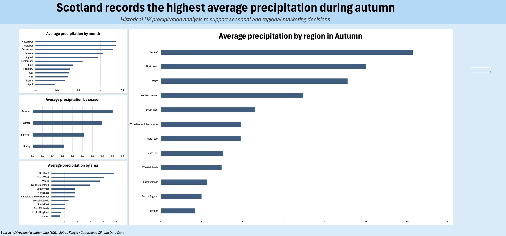

# UK Marketing Campaign Optimization (Umbrellas)

## Introduction

This project analyzes historical UK precipitation data (1961–2024) to support data-driven marketing decisions for an umbrella company.

Using seasonal and regional precipitation patterns, the goal is to determine **when** and **where** advertising budget should be concentrated to maximize campaign efficiency.

The final output includes a dashboard summarizing monthly, seasonal, and regional rainfall trends to guide strategic marketing allocation.

---

## Background

The company currently distributes advertising budget uniformly across the year and across UK regions.

However, umbrella demand is highly influenced by rainfall patterns. By analyzing historical precipitation data, we can identify:

- The months with highest average rainfall  
- The seasons with strongest precipitation  
- The UK regions most likely to generate higher umbrella demand  

This analysis supports **strategic planning decisions**, not real-time optimization.

---

## Key Questions

1. Which months show the highest average precipitation in the UK?
2. Which season records the highest rainfall?
3. Which UK regions experience the highest average precipitation?
4. Which regions record the highest precipitation specifically during Autumn?
5. How can these insights support more efficient marketing allocation?

---

## Tools Used

- Excel – Data cleaning and aggregation
- Pivot Tables – Monthly, seasonal, and regional summaries
- Data Visualization – Dashboard creation
- Historical UK precipitation dataset (1961–2024)

---

# Analysis

---

## Question 1 – Which months show the highest average precipitation?

### Description
Identify months with consistently high rainfall to determine optimal campaign timing.

### Approach
- Aggregate precipitation by month across all regions
- Calculate average precipitation per month
- Rank months by rainfall level

### Goal
Determine the best months to increase advertising spend.

### Output
Dashboard section: *Average precipitation by month*

### Key Findings
- **October, November, and December** show the highest average precipitation.
- Late autumn months consistently outperform spring and summer months.
- April records the lowest rainfall among the analyzed months.

**Marketing implication:** Increase advertising budget starting in October.

---

## Question 2 – Which season records the highest rainfall?

### Description
Compare seasonal rainfall averages to identify high-demand periods.

### Approach
- Group months into seasons
- Calculate average precipitation per season
- Compare seasonal rainfall levels

### Goal
Identify the strongest season for umbrella demand.

### Output
Dashboard section: *Average precipitation by season*

### Key Findings
- **Autumn records the highest average precipitation.**
- Winter follows closely behind.
- Spring and Summer show significantly lower rainfall.

**Marketing implication:** Concentrate major campaigns in Autumn, maintain presence in Winter.

---

## Question 3 – Which UK regions experience the highest average precipitation?

### Description
Determine which regions consistently experience higher rainfall levels.

### Approach
- Aggregate precipitation by region
- Calculate average precipitation across all months
- Rank regions from highest to lowest rainfall

### Goal
Identify priority geographic markets.

### Output
Dashboard section: *Average precipitation by area*

### Key Findings
- **Scotland records the highest overall precipitation.**
- North West and Wales follow closely.
- London and East of England record the lowest rainfall levels.

**Marketing implication:** Allocate larger budget share to Scotland and North West.

---

## Question 4 – Which regions have the highest precipitation in Autumn?

### Description
Analyze Autumn rainfall by region to refine seasonal targeting.

### Approach
- Filter dataset for Autumn months
- Aggregate precipitation by region
- Compare regional rainfall levels

### Goal
Identify the strongest regional opportunities during peak season.

### Output
Dashboard section: *Average precipitation by region in Autumn*

### Key Findings
- **Scotland records the highest Autumn precipitation.**
- North West and Wales also show strong rainfall levels.
- Southern regions show lower precipitation.

**Marketing implication:** Launch region-focused Autumn campaigns targeting Scotland and North West.

---

## Question 5 – How should marketing budget be optimized?

### Description
Translate precipitation insights into strategic recommendations.

### Approach
- Combine seasonal and regional findings
- Identify high-rainfall months and regions
- Propose targeted allocation strategy

### Goal
Support more efficient advertising spend allocation.

### Key Findings
- Prioritize **Autumn campaigns**
- Increase spend in **Scotland, North West, and Wales**
- Reduce uniform distribution across low-rainfall regions
- Maintain moderate Winter presence

---

# What I Learned

Through this project, I strengthened my ability to translate environmental data into business strategy.

- I improved my ability to aggregate time-series data by month and season.
- I developed stronger skills in regional comparison and ranking analysis.
- I reinforced the importance of linking data analysis to clear business decisions.
- I learned how to structure insights for stakeholders rather than just presenting charts.

This project demonstrates how data can guide strategic marketing allocation using structured analysis and clear reasoning.

---

# Conclusions

This analysis demonstrates that umbrella demand potential is not uniform across time or geography.

- Autumn is the strongest seasonal opportunity.
- Scotland presents the highest regional opportunity.
- Marketing allocation should follow precipitation intensity patterns.

By aligning advertising spend with historical rainfall trends, companies can improve campaign efficiency,reduce wasted budget and increase profits.

---

# Closing Thoughts

This project reflects my approach as a Data Analyst:

Start with a business question → analyze structured data → extract measurable insights → translate findings into actionable recommendations.

Rather than simply visualizing data, I focused on supporting a clear marketing decision with evidence.

The ability to connect data patterns to strategic actions is what transforms analysis into business value.
